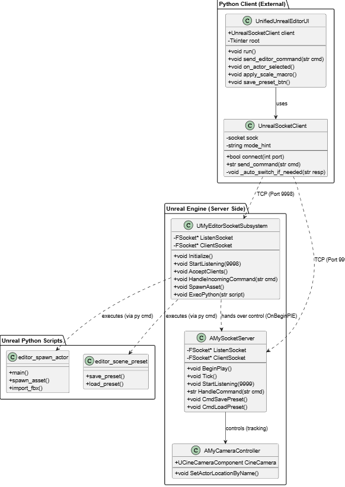
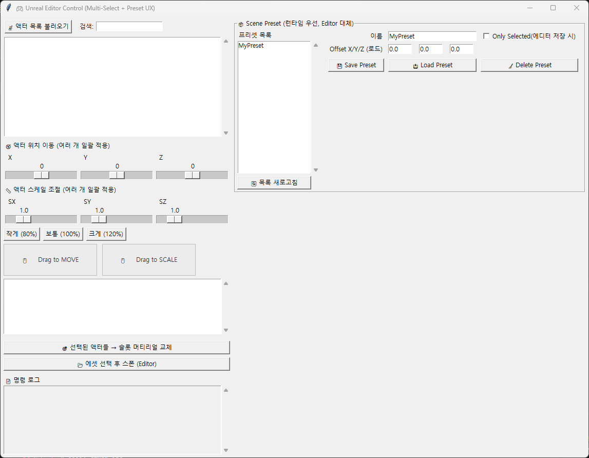
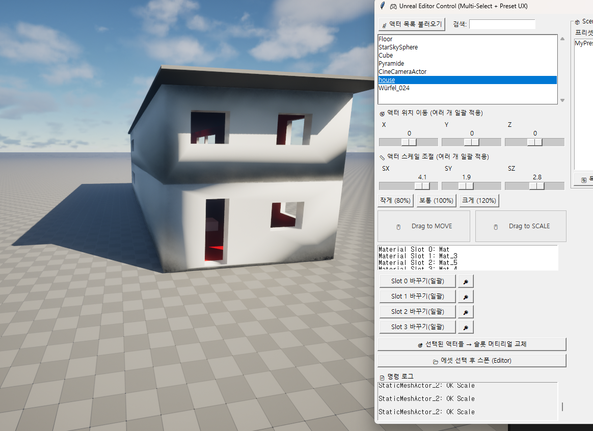
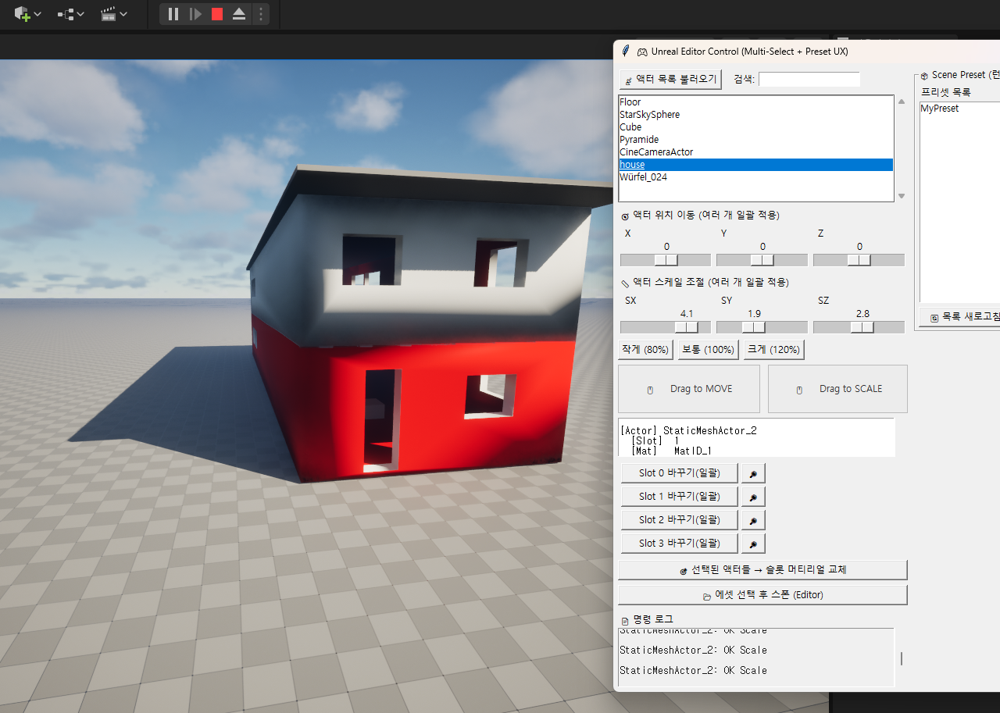

# 🎮 Unreal Engine Remote Control Tool

> **Python(Tkinter) 클라이언트를 통해 외부에서 언리얼 엔진의 액터를 실시간으로 제어하고, 씬(Scene) 상태를 관리하는 원격 제어 툴입니다.**

이 프로젝트는 Unreal Engine 5와 Python 간의 **TCP 소켓 통신**을 기반으로 합니다.  
사용자는 에디터 뷰포트를 직접 조작하지 않고도, 외부 GUI 툴을 사용하여 액터의 Transform을 변경하거나 머티리얼을 교체하고, 현재 씬의 상태를 프리셋으로 관리할 수 있습니다.

---

## 🏗 System Architecture

Python 클라이언트와 언리얼 엔진(Server) 간의 통신 구조입니다. **Editor Mode**와 **Runtime(PIE) Mode**를 모두 지원하기 위해 이원화된 소켓 시스템을 구축했습니다.

  

---

## ✨ Key Features & Demos

### 1. 🖥️ Intuitive Python Controller (GUI)
Tkinter를 활용하여 직관적인 사용자 인터페이스를 구축했습니다.
* **Multi-Select**: 여러 액터를 리스트에서 선택하여 일괄 제어 가능
* **Preset Management**: 우측 패널에서 씬 상태를 저장/로드/삭제 가능
* **Command Log**: 하단 로그 창을 통해 소켓 통신 상태 실시간 확인

 

### 2. 📏 Real-time Transform Control
드래그 제스처 패드(Drag Pad) 또는 정밀 슬라이더를 통해 액터의 위치와 크기를 실시간으로 조절합니다.
* **Drag to Scale/Move**: 마우스 드래그로 직관적인 조작
* **Synchronization**: 언리얼 엔진 뷰포트와 지연 없는(Low-latency) 동기화

 

### 3. 📦 Remote Asset Spawning
외부의 FBX 파일이나 프로젝트 내부의 에셋을 선택하여 씬에 즉시 스폰합니다.
* **Automation**: Python 스크립트(`editor_spawn_actor.py`)를 통해 에셋 로드 및 배치 자동화
* **Editor Integration**: 에디터 모드에서도 정상 작동 (Editor Subsystem 활용)

 

### 4. 🎨 Material Slot Management
선택한 액터의 머티리얼 슬롯 정보를 파싱하여 보여주고, 원하는 슬롯의 머티리얼을 즉시 교체합니다.

> **(좌) 변경 전 슬롯 확인 → (우) 변경 후 적용 모습**

| **Material Info & Selection** | **After Replacement** |
| :---: | :---: |
|  |  |

* `.uasset` 파일 경로를 자동으로 감지하여 `/Game/Content/...` 경로로 변환 후 적용
* 특정 슬롯(Slot Index)만 타겟팅하여 부분 수정 가능

---

## 🛠 Tech Stack

| Category | Technology |
| :--- | :--- |
| **Engine** | Unreal Engine 5.x (C++, Python API) |
| **Language** | C++, Python 3.x |
| **UI Framework** | Python `tkinter` |
| **Communication** | TCP/IP Socket |
| **Data Format** | JSON (Scene Preset System) |

---

## 💻 Implementation Details

### 1. Dual Socket Strategy
* **Editor Mode**: `FTSTicker`를 사용하여 에디터 틱마다 소켓을 폴링, 게임 미실행 상태에서도 제어 가능.
* **Runtime Mode**: `AActor` 기반 서버가 게임 로직과 상호작용하며 실시간 제어.

### 2. Command Protocol
* `MOVE/SCALE`: 액터 트랜스폼 제어
* `SET_MATERIAL`: 머티리얼 경로 파싱 및 적용
* `SAVE_PRESET`: 현재 씬 상태(액터 정보)를 JSON 직렬화하여 저장

---

## 👨‍💻 Author

**Hwnsgus**
* **Role**: Client & Tool Developer
* **Contact**: [h010617@naver.com]
